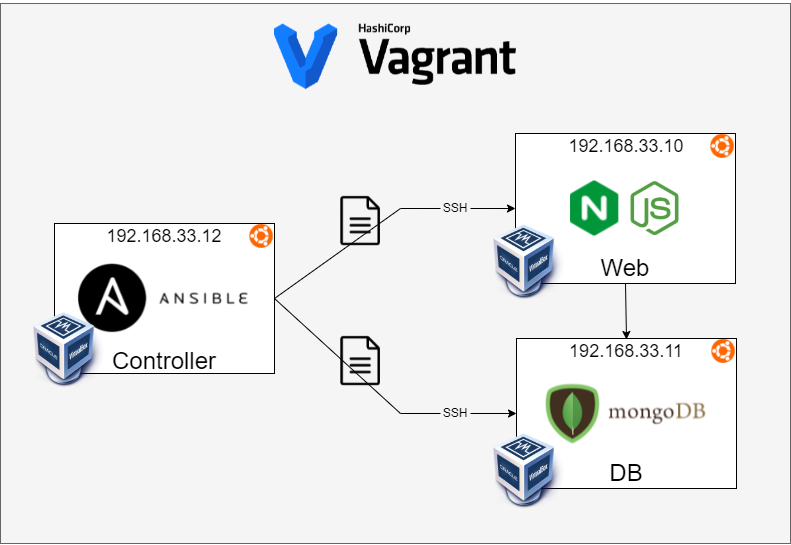
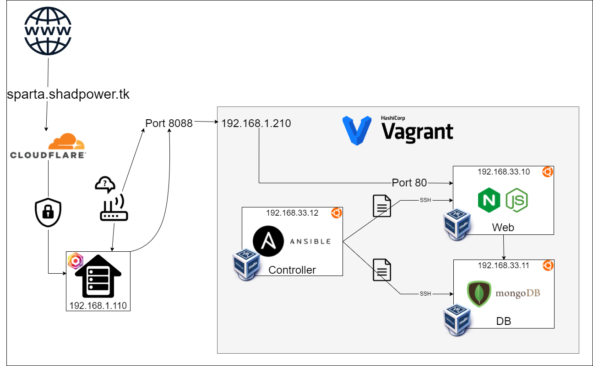

# IAC with Ansible



## Install Ansible and tree
- `sudo apt-add-repository`
- `sudo apt install ansible tree`


## Configure agent nodes for Ansible

configure each agent node by adding them in `/etc/ansible/hosts` like this:
```
[web]
192.168.33.10 ansible_connection=ssh ansible_ssh_user=vagrant ansible_ssh_pass=vagrant

[db]
192.168.33.11 ansible_connection=ssh ansible_ssh_user=vagrant ansible_ssh_pass=vagrant
```

test the connection by pinging them `ansible all -m ping`

copy host file to agent `ansible web -m copy -a "src=/etc/ansible/README.md dest=/home/vagrant/README.md"`

test file has been copied `ansible web -a 'ls'`


## [Ansible Playbooks](sync/Playbooks)
playbooks are reusable yaml/yml script files to implement config management. (filename.yaml/yml)

### Playbook syntax

#### Playbook header
```
---
# Add name of Host/IP/group
- hosts: web
# Collect logs
  gather_facts: yes
# sudo or not?
  become: true
  tasks
  - name: task name here
    task:
      arg:
      arg2:
```

#### Tasks
- `apt` apt package manager, `pkg` to define package, `state=present` to set the package to running, `update_cache: yes` for updating package list and  `upgrade: yes` to upgrade packages.
- `copy` to copy files to agent/s, `src` for source, `dest` for destination and `force: yes` for forcing overwriting.
- `service` similar to `systemctl`, `name` to define service name, `state=restarted` to restart service, `enabled=yes` to enable service.
- `shell` to run shell commands, separated by a comma.
- `lineinfile` to edit a text file, `path` to define file path, use `line` to append, use `regexp` and `insertafter` in conjuntion to `line` to replace text.


## A more advanced set-up using VitualBox port-forwarding, Cloudflare tunnel (Cloudflare Argo)




## Ansible with AWS

### Hybrid where Ansible is on Prem

#### Set-up Ansible and Ansible-Vault for AWS:
- install `tree` `python3` `ansible` `pip3` apt packages, and `awscli` `boto3` pip3 packages.
- `alias python=python3`
- set-up ansible vault with aws access & secret keys in `pass.yml` at `/etc/ansible/group_vars/all/` and create folders as appropriate.
- `ansible-vault create pass.yml`
- `chmod 600 pass.yml`
- `sudo ansible db -m ping --ask-vault-pass`

### EC2 Launch instance yml file

`ssh-keygen -t rsa -b 4096` in `.ssh` folder.

```
---
- hosts: localhost
  connection: local
  gather_facts: yes
  vars_files:
  - /etc/ansible/group_vars/all/pass.yml
  vars:
    key_name: id_rsa
    region: eu-west-1
    image: ami-07d8796a2b0f8d29c
    id: "shadman-ansible"
    sec_group: "{{ id }}-sec"
  tasks:
    - name: Provisioning EC2 instances
      block:
      - name: Upload public key to AWS
        ec2_key:
          name: "{{ key_name }}"
          key_material: "{{ lookup('file', '/home/vagrant/.ssh/id_rsa.pub') }}"
          region: "{{ region }}"
          aws_access_key: "{{aws_access_key}}"
          aws_secret_key: "{{aws_secret_key}}"
      - name: Create security group
        ec2_group:
          name: "{{ sec_group }}"
          description: "Sec group for app {{ id }}"
          # vpc_id: 12345
          # vpc_id: 12345
          region: "{{ region }}"
          aws_access_key: "{{aws_access_key}}"
          aws_secret_key: "{{aws_secret_key}}"
          rules:
            - proto: tcp
              ports:
                - 22
              cidr_ip: 0.0.0.0/0
              rule_desc: allow all on ssh port
            - proto: tcp
              ports:
                - 80
              cidr_ip: 0.0.0.0/0
              rule_desc: allow all on http port
        register: result_sec_group
      - name: Provision instance(s)
        ec2:
          aws_access_key: "{{aws_access_key}}"
          aws_secret_key: "{{aws_secret_key}}"
          key_name: "{{ key_name }}"
          id: "{{ id }}"
          group_id: "{{ result_sec_group.group_id }}"
          image: "{{ image }}"
          instance_type: t2.micro
          region: "{{ region }}"
          wait: true
          count: 1
          instance_tags:
            Name: eng103a_shadman_ansible
      tags: ['never', 'create_ec2']
```

To hosts file add
```
[aws]
52.209.189.160 ansible_connection=ssh ansible_ssh_user=ubuntu ansible_ssh_private_key_file=/home/vagrant/.ssh/id_rsa
```
### AWS create **Web** and **DB** EC2 using Ansible Playbooks

#### Web EC2 Playbook
```
---
- hosts: localhost
  connection: local
  gather_facts: yes
  vars_files:
  - /etc/ansible/group_vars/all/pass.yml
  vars:
    key_name: id_rsa
    region: eu-west-1
    image: ami-07d8796a2b0f8d29c
    id: "eng103a-shadman-web"
    sec_group: "{{ id }}-sec"
  tasks:
    - name: Provisioning EC2 instances
      block:
      - name: Upload public key to AWS
        ec2_key:
          name: "{{ key_name }}"
          key_material: "{{ lookup('file', '/home/ubuntu/.ssh/id_rsa.pub') }}"
          region: "{{ region }}"
          aws_access_key: "{{aws_access_key}}"
          aws_secret_key: "{{aws_secret_key}}"
      - name: Create security group
        ec2_group:
          name: "{{ sec_group }}"
          description: "Sec group for app {{ id }}"
          region: "{{ region }}"
          aws_access_key: "{{aws_access_key}}"
          aws_secret_key: "{{aws_secret_key}}"
          rules:
            - proto: tcp
              ports:
                - 22
              cidr_ip: 0.0.0.0/0
              rule_desc: allow all on ssh port
            - proto: tcp
              ports:
                - 80
              cidr_ip: 0.0.0.0/0
              rule_desc: allow all on http port
        register: result_sec_group
      - name: Provision instance(s)
        ec2:
          aws_access_key: "{{aws_access_key}}"
          aws_secret_key: "{{aws_secret_key}}"
          key_name: "{{ key_name }}"
          id: "{{ id }}"
          group_id: "{{ result_sec_group.group_id }}"
          image: "{{ image }}"
          instance_type: t2.micro
          region: "{{ region }}"
          wait: true
          count: 1
          # exact_count: 2
          # count_tag:
          #   Name: App
          # instance_tags:
          #   Name: App
          instance_tags:
            Name: eng103a_shadman_web
      tags: ['never', 'create_ec2']
```

#### DB EC2 Playbook
```
---
- hosts: localhost
  connection: local
  gather_facts: yes
  vars_files:
  - /etc/ansible/group_vars/all/pass.yml
  vars:
    key_name: id_rsa
    region: eu-west-1
    image: ami-07d8796a2b0f8d29c
    id: "eng103a-shadman-db"
    sec_group: "{{ id }}-sec"
  tasks:
    - name: Provisioning EC2 instances
      block:
      - name: Upload public key to AWS
        ec2_key:
          name: "{{ key_name }}"
          key_material: "{{ lookup('file', '/home/ubuntu/.ssh/id_rsa.pub') }}"
          region: "{{ region }}"
          aws_access_key: "{{aws_access_key}}"
          aws_secret_key: "{{aws_secret_key}}"
      - name: Create security group
        ec2_group:
          name: "{{ sec_group }}"
          description: "Sec group for app {{ id }}"
          region: "{{ region }}"
          aws_access_key: "{{aws_access_key}}"
          aws_secret_key: "{{aws_secret_key}}"
          rules:
            - proto: tcp
              ports:
                - 22
              cidr_ip: 0.0.0.0/0
              rule_desc: allow all on ssh port
            - proto: tcp
              ports:
                - 27017
              cidr_ip: 0.0.0.0/0
              rule_desc: allow all on http port
        register: result_sec_group
      - name: Provision instance(s)
        ec2:
          aws_access_key: "{{aws_access_key}}"
          aws_secret_key: "{{aws_secret_key}}"
          key_name: "{{ key_name }}"
          id: "{{ id }}"
          group_id: "{{ result_sec_group.group_id }}"
          image: "{{ image }}"
          instance_type: t2.micro
          region: "{{ region }}"
          wait: true
          count: 1
          # exact_count: 2
          # count_tag:
          #   Name: App
          # instance_tags:
          #   Name: App
          instance_tags:
            Name: eng103a_shadman_db
      tags: ['never', 'create_ec2']
```

### [AWS Ansible Playbooks](sync/AWS-Playbooks)
- remember to `scp` the ssh key value pairs, the `app` folder, and the `default` nginx config file
- remember `became_user: ubuntu`

### Extra
```
sudo apt remove --purge python3 
sudo apt remove --purge python3-pip
sudo apt install software-properties-common -y
sudo add-apt-repository ppa:deadsnakes/ppa
sudo apt install python3.9 -y
update-alternatives --install /usr/bin/python python /usr/bin/python3 1
python --version
```

```
sudo apt update && sudo apt upgrade -y
sudo apt-add-repository ppa:ansible/ansible
sudo apt install ansible python3-pip
pip3 install boto botocore boto3 awscli
```